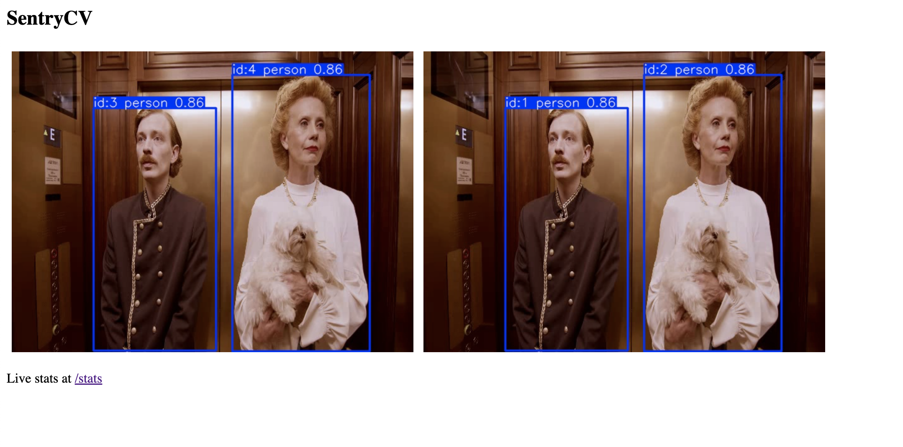

# SentryCV

#

A small computer vision project that watches two camera feeds, finds the people and vehicles in them, follows each person as they move, and recognizes when the same person shows up in both cameras. It does all of this cheaply, by only waking up the heavy detection model when something in the frame actually moves.

I built it to mirror how Verkada's computer vision team works: real time detection and tracking of people and vehicles, across many cameras, done efficiently at the edge, in a way that respects privacy.

## The idea behind it

Running a detection model on every single frame of video is expensive. Verkada's team wrote about this openly. When they first added people and vehicle detection, running the detector continuously would have cost roughly one GPU per camera, so they added a cheap motion check on each camera and only ran the expensive model when there was something worth looking at. That one change cut their compute by about ten times.

This project does the same thing. A lightweight motion check runs on every frame, and the real detector only wakes up when the scene changes. The headline number the project reports is how much detection work it saved by doing this, which is the same tradeoff Verkada cares about every day.

## How the pieces map to Verkada

| What it does | Where it lives | What it mirrors at Verkada |
|---|---|---|
| Skips quiet frames to save compute | `src/motion_gate.py` | Their motion preprocessing that cut GPU load about ten times |
| Finds and follows people and vehicles | `src/pipeline.py` | People and vehicle detection with stable tracking IDs |
| Recognizes the same person across cameras | `src/reid.py` | People Analytics, which tracks people across cameras |
| Shows it all live | `app/main.py` | Their Command platform, where security teams review footage |

## Getting it running

```bash
python -m venv .venv && source .venv/bin/activate
pip install -r requirements.txt
# add your own video as data/cam0.mp4 and data/cam1.mp4 (see data/README.md)
python run.py                 # prints the compute saved and the people found across cameras
uvicorn app.main:app --reload # opens the live dashboard at http://localhost:8000
```

## The numbers worth reporting

These are what make the project read like real engineering rather than a tutorial.

The main one is the percentage of detection work saved by the motion gate. That is your headline. Alongside it, if you label a short clip, you can report detection accuracy and tracking quality (MOTA and IDF1), plus how often the re-identification correctly matches the same person across the two cameras.

## A three day plan

Day one is about one camera and the efficiency win. Get a single video in, run the pipeline on it, and confirm the detector is drawing stable IDs on the people it finds. Then tune the motion sensitivity until the compute saved number is meaningful, somewhere in the range of forty to eighty percent on normal footage. This alone is already a strong story to tell.

Day two adds the second camera and the cross camera recognition. The pipeline saves a crop of each person it sees, so once both cameras have run, the re-identification step matches those crops and gives the same person one shared ID across both views. Tune the similarity threshold until the matches look right.

Day three is polish. Bring up the live dashboard so both feeds and the running stats are visible in the browser, write your real numbers into this README, add a Dockerfile, and push it all to GitHub.

## If you want to go further

A few additions take this from strong to genuinely impressive. You could add a search feature, so you can type something like "find the person in the red jacket" and pull them out of the footage, which is close to what Verkada's People Analytics does. You could add heat map style explanations that show what the model was looking at when it flagged something, which builds trust. And you could blur faces by default unless someone turns that off, which speaks directly to Verkada's promise of protecting people in a privacy respecting way.

## A couple of notes

The detection model downloads itself the first time you run it, so the first run will be a little slower. You can swap in a larger model later for better accuracy. And remember that on quiet frames the detector is skipped entirely. That is not a bug, that is the whole point of the project.
